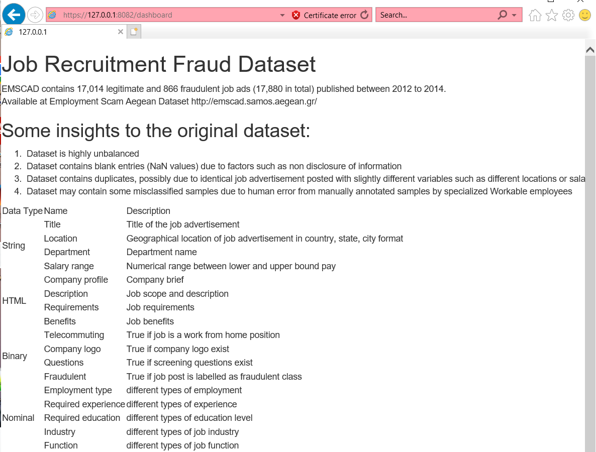

# Fraud detection with artificial neural network

A locally-hosted demo web app built with Python, FLASK and SQLite to determine whether a job post is legitimate or fraudulent. The dataset is trained on with artificial neural network. 

### Web page:

Self explanatory landing page

Information on the dataset

Job fraud detection page. For now the web app accepts input as a .csv file. The input will be fed to the saved model for deployment.

Output of the model is returned as a list for now. Not planning to do UI/UX here.

### Methodology

Dataset sample is too small with highly imbalanced class. Oversampling of the class with lower samples is used. Dataset is then splitted into training, validation and test set. Data is heavily pre-processed before use.

### Performance:

Accuracy plot

 

Loss plot

Confusion matrix plot

Report of test dataset results

